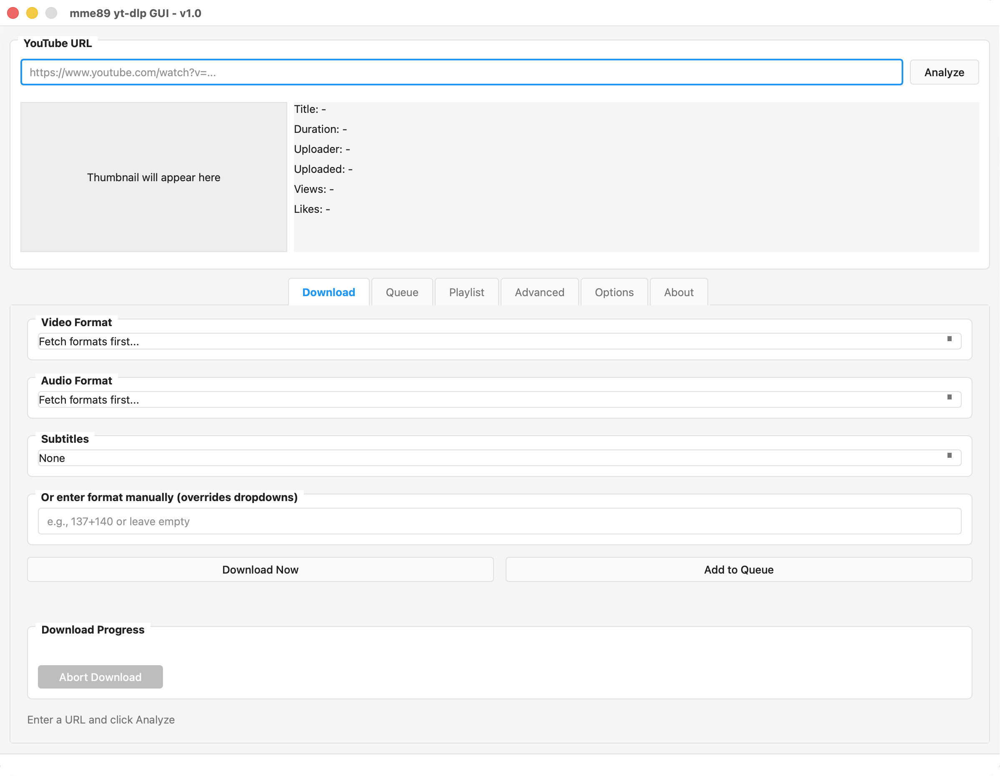
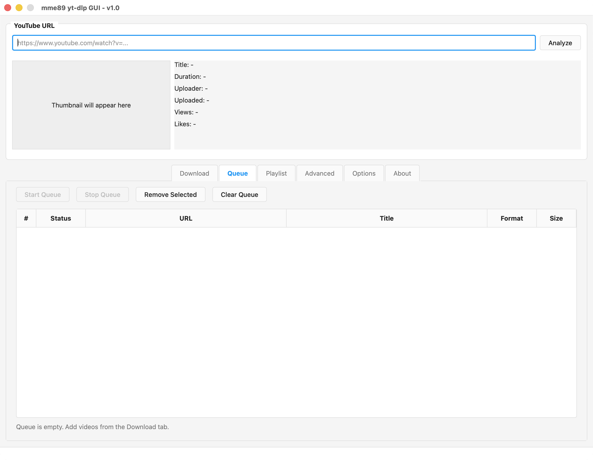

# yt-dlp GUI

[](https://github.com/mme89/yt-dlp-gui/releases)
[](https://github.com/mme89/yt-dlp-gui/releases)
[](https://github.com/mme89/yt-dlp-gui/blob/main/LICENSE)
[](https://github.com/mme89/yt-dlp-gui)

A modern, cross-platform GUI wrapper for [yt-dlp](https://github.com/yt-dlp/yt-dlp). This application provides an easy-to-use graphical interface for downloading videos without using the command line.

## Screenshots

<div align="center">
  
  <p><em>Main download interface with format selection</em></p>
</div>

<div align="center">
  
  <p><em>Playlist management with selective downloads</em></p>
</div>

<div align="center">
  
  <p><em>Download queue for batch processing</em></p>
</div>

## Features

- 🎥 Download videos from YouTube
- 🎨 Clean, modern interface with cross-platform styling
- 📊 Format selection with detailed information (resolution, codec, file size)
- 📝 Subtitle support (auto-generated and manual)
- 📋 Download queue management
- 🎵 Playlist support with selective downloads
- 🖼️ Video thumbnail preview
- 📈 Real-time download progress tracking
- ⚙️ Advanced options and custom arguments
- 🪟 Separate terminal window for detailed output

## Requirements

This application requires [yt-dlp](https://github.com/yt-dlp/yt-dlp) and [FFmpeg](https://github.com/FFmpeg/FFmpeg) to be installed on your system.

## Installation

### Option 1: Download Pre-built Application (Recommended)

Download the latest release for your platform from the [Releases](https://github.com/mme89/yt-dlp-gui/releases) page:

- **macOS**: Download `yt-dlp-gui-mac.zip`, extract, and run the `.app`
- **Windows**: Download `yt-dlp-gui-windows.zip`, extract, and run the `.exe`
- **Linux**: Download `yt-dlp-gui-linux.tar.gz`, extract, and run the executable

### Option 2: Run from Source

1. Clone this repository:
```bash
git clone https://github.com/mme89/yt-dlp-gui.git
cd yt-dlp-gui
```

2. Install Python dependencies:
```bash
pip install -r requirements.txt
```

3. Run the application:
```bash
python yt-dlp-gui.py
```

### Option 3: Build Standalone Application

If you want to create your own standalone executable:

**macOS:**
```bash
pyinstaller build-specs/yt-dlp-gui-mac.spec
```

**Windows:**
```bash
pyinstaller build-specs/yt-dlp-gui-windows.spec
```

**Linux:**
```bash
pyinstaller build-specs/yt-dlp-gui-linux.spec
```

The built application will be in the `dist/` folder.

## Usage

### Basic Workflow

1. Paste a YouTube URL in the input field
2. Click "Analyze" to fetch available formats
3. Select your preferred video and audio formats
4. Choose download location in the Options tab
5. Click "Download Now" or "Add to Queue"

### Features Guide

- **Download Tab**: Select formats and download individual videos
- **Queue Tab**: Manage multiple downloads sequentially
- **Playlist Tab**: Load and download entire playlists with quality presets
- **Advanced Tab**: Add custom yt-dlp arguments
- **Options Tab**: Configure download paths and yt-dlp location

## Configuration

Settings are automatically saved to `settings.json` in the application directory, including:
- Download path
- yt-dlp executable path
- Window preferences

## Troubleshooting

**"yt-dlp not found"**
- Ensure yt-dlp is installed and in your PATH
- Or specify the full path in Options → yt-dlp Path

**"FFmpeg not found"**
- Install FFmpeg and ensure it's in your PATH
- Required for merging separate video/audio streams

**Format fetching fails**
- Check your internet connection
- Verify the URL is valid
- Some videos may have region restrictions

## Note

This project was created with the assistance of AI to provide a user-friendly interface for yt-dlp.

## Contributing

Contributions are welcome! Feel free to open issues or submit pull requests.
